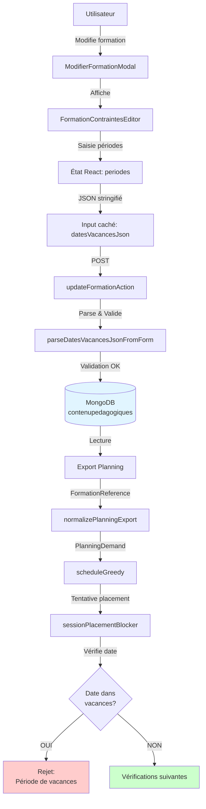
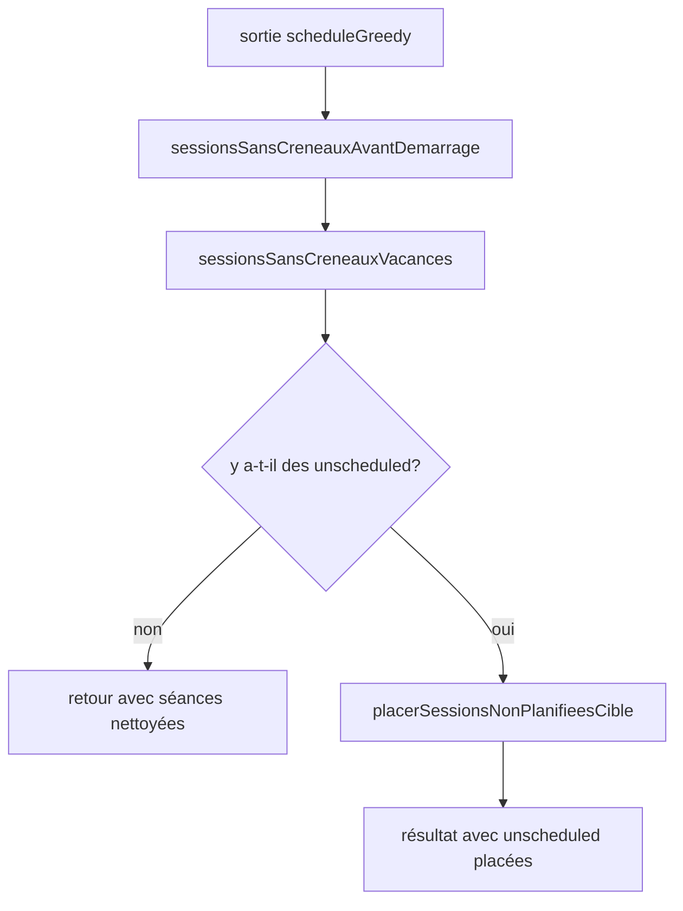
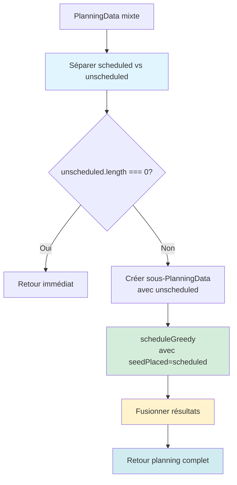

# Contrainte : Dates de Vacances

## Vue d'ensemble

La contrainte de dates de vacances permet de définir des périodes pendant lesquelles aucun cours ne peut être planifié pour une formation donnée. Cette fonctionnalité est essentielle pour respecter les calendriers scolaires (vacances de Noël, vacances d'été, ponts, etc.).

## Fonctionnalité utilisateur

### Où définir les périodes de vacances

Les périodes de vacances se définissent **uniquement lors de la modification** d'une formation existante, dans la section "Contraintes de planification (formation)".

1. Accéder à **Administration > Création formation**
2. Cliquer sur **Modifier** pour une formation existante
3. Dans la modale de modification, descendre jusqu'à la section **"Contraintes de planification (formation)"**
4. Trouver la sous-section **"5. Périodes de vacances"**
5. Cliquer sur **"+ Ajouter une période de vacances"**

### Saisir une période de vacances

Lors de l'ajout d'une période, trois champs sont requis :

- **Nom de la période** : Description de la période (ex: "Vacances de Noël 2025", "Pont de l'Ascension 2026")
  - Maximum 100 caractères
  - Doit être unique et descriptif

- **Date de début** : Premier jour de vacances (format : YYYY-MM-DD)
  - Sélectionner via le calendrier

- **Date de fin** : Dernier jour de vacances (format : YYYY-MM-DD)
  - Doit être postérieure ou égale à la date de début
  - Sélectionner via le calendrier

### Gérer les périodes existantes

- **Visualiser** : Chaque période affiche son nom et la plage de dates ("du ... au ...")
- **Supprimer** : Cliquer sur le bouton **×** à droite de la période
- **Modifier** : ⚠️ Non disponible actuellement - supprimer et recréer si nécessaire

## Comportement du planning

### Blocage automatique

Une fois les périodes de vacances définies pour une formation :

1. **Placement automatique** : Le moteur de planification (`scheduleGreedy`) ne placera AUCUNE séance pendant les périodes de vacances
2. **Échanges manuels** : Les tentatives de déplacer manuellement une séance vers une période de vacances seront bloquées
3. **Message d'erreur** : Si un placement est tenté pendant les vacances, le message suivant apparaît :
   ```
   Période de vacances ([Nom de la période]) — cours non autorisé pendant cette période.
   ```

### Conditions d'application

La vérification des vacances nécessite :
- Un **calendrier complet** configuré (champ `semaine1LundiIso` dans la grille)
- Des **périodes de vacances valides** définies pour la formation
- Le planning doit pouvoir calculer la date civile du créneau

Si le calendrier n'est pas configuré, le message suivant apparaît :
```
Calendrier incomplet : indiquez le lundi de la semaine 1 pour appliquer les périodes de vacances.
```

## Structure de données

### MongoDB

Dans la collection `contenupedagogiques`, le champ `datesVacances` est un tableau de périodes :

```json
{
  "_id": "...",
  "nom": "Formation BTS 2025-2026",
  "datesVacances": [
    {
      "debut": "2025-10-18",
      "fin": "2025-11-03",
      "nom": "Vacances de la Toussaint 2025"
    },
    {
      "debut": "2025-12-20",
      "fin": "2026-01-05",
      "nom": "Vacances de Noël 2025"
    },
    {
      "debut": "2026-02-14",
      "fin": "2026-03-02",
      "nom": "Vacances d'hiver 2026"
    }
  ]
}
```

**Schéma Mongoose** (`app/src/lib/models/Formation.ts`) :

```typescript
const FormationVacancePeriodeSchema = new Schema(
  {
    debut: { type: String, required: true, maxlength: 10 },
    fin: { type: String, required: true, maxlength: 10 },
    nom: { type: String, required: true, maxlength: 100 },
  },
  { _id: false }
);

// Dans FormationSchema :
datesVacances: {
  type: [FormationVacancePeriodeSchema],
  default: [],
  validate: {
    validator: (periodes) => periodes.every((p) => p.debut <= p.fin),
    message: "La date de fin doit être postérieure ou égale à la date de début",
  },
}
```

### Export Planning

Les périodes sont transportées dans l'export planning via deux types :

**FormationReference** (`planning.types.ts`) :
```typescript
export type FormationReference = {
  // ... autres champs
  datesVacances?: Array<{ debut: string; fin: string; nom: string }>;
}
```

**PlanningDemand** (`planning.types.ts`) :
```typescript
export type PlanningDemand = {
  // ... autres champs
  formationDatesVacances: Array<{ debut: string; fin: string; nom: string }>;
}
```

## Flux technique



## Post-traitement et réparation

Même lorsque le placement glouton respecte `sessionPlacementBlocker`, des séances peuvent se retrouver sur des jours de vacances (ex. réplication de gabarit sur plusieurs semaines, données exportées avant la saisie des vacances, calendrier complété après coup). Une **passe de réparation** corrige ce cas.

### Fonctions (`planning-scheduler.ts`)

| Fonction | Rôle |
|----------|------|
| `sessionsSansCreneauxVacances` | Pour chaque séance `scheduled`, calcule la date civile du créneau ; si elle tombe dans une période de `formationDatesVacances`, la séance passe en `unscheduled` et perd créneau / salle. Sans `semaine1LundiIso` valide, aucune modification (impossible de calculer la date). |
| `sessionsSansCreneauxAvantDemarrage` | Déjà présente : retire les créneaux strictement avant `dateDemarrageIso`. |
| `repairPlanningVacancesEtDemarrage` | Applique les deux nettoyages ; s’il reste des séances `unscheduled`, relance un passage `scheduleGreedy` (sans `runPostVacationRepair` pour éviter une boucle infinie). |
| `repairPlanningAvecVacances` | Alias exporté de `repairPlanningVacancesEtDemarrage` pour réparation manuelle d’un `PlanningData` déjà produit. |

### Intégration automatique

Par défaut, **`scheduleGreedy` n’enchaîne pas** avec la réparation complète (coût prohibitif sur de grands plannings). Vous pouvez passer **`runPostVacationRepair: true`** dans les options de `scheduleGreedy` pour forcer nettoyage + second placement.

En **mode répétition** (`scheduleGreedyRepetitionMode`), seules les passes rapides **`sessionsSansCreneauxAvantDemarrage`** puis **`sessionsSansCreneauxVacances`** sont appliquées sur le jeu répliqué : les séances qui tombent en vacances passent en `unscheduled` **sans** second passage glouton automatique. Pour un re-placement complet, appelez **`repairPlanningAvecVacances`** (ou `repairPlanningVacancesEtDemarrage`) explicitement, idélement en arrière-plan si le volume est élevé.

### Diagramme (résumé)



## Placement ciblé des sessions non planifiées

### Vue d'ensemble

Après le nettoyage des vacances (et dates de démarrage), au lieu de re-placer **TOUTES** les sessions, le système utilise maintenant un placement **ciblé** beaucoup plus performant.

**Principe** :
1. **Conservation** : Toutes les sessions `scheduled` restent à leur place (aucun déplacement)
2. **Extraction** : Seules les sessions `unscheduled` sont identifiées
3. **Placement ciblé** : `scheduleGreedy` ne travaille que sur les sessions `unscheduled`
4. **Fusion** : Les résultats sont réinjectés dans le planning sans modifier les sessions déjà placées

### Gain de performance

**Exemple concret** : Pour un planning de **1000 sessions** dont **100 sont unscheduled** après nettoyage :
- ❌ **Avant** : re-placement complet de 1000 sessions → ~10-30 secondes
- ✅ **Après** : placement ciblé de 100 sessions → ~1-3 secondes

Le placement ciblé ne traite que **10%** des données au lieu de **100%**, soit un gain de performance de **~10x**.

### Implémentation technique

La nouvelle fonction `placerSessionsNonPlanifieesCible` (dans `planning-scheduler.ts`) :

```typescript
function placerSessionsNonPlanifieesCible(
  data: PlanningData,
  grid: PlanningGridConfig,
  options?: ScheduleGreedyOptions
): PlanningData {
  // 1. Séparer scheduled et unscheduled
  const scheduled = data.sessions.filter(s => s.statut === "scheduled");
  const unscheduled = data.sessions.filter(s => s.statut === "unscheduled");
  
  // 2. Si aucune unscheduled, retour immédiat
  if (unscheduled.length === 0) return data;
  
  // 3. Créer un sous-PlanningData avec uniquement les unscheduled
  const subData: PlanningData = { ...data, sessions: unscheduled };
  
  // 4. Placer avec seedPlaced = sessions déjà scheduled (évite collisions)
  const result = scheduleGreedy(subData, grid, {
    ...options,
    seedPlaced: scheduled,      // ← Les sessions scheduled sont protégées
    runPostVacationRepair: false, // ← Évite récursion infinie
  });
  
  // 5. Fusionner les résultats
  const resultById = new Map(result.sessions.map(s => [s.id, s]));
  const mergedSessions = data.sessions.map(s => resultById.get(s.id) ?? s);
  
  return { ...data, sessions: mergedSessions };
}
```

### Fonction publique : `completerPlanningAvecSessionsNonPlanifiees`

Une fonction publique est exportée pour permettre l'utilisation manuelle du placement ciblé :

```typescript
export function completerPlanningAvecSessionsNonPlanifiees(
  data: PlanningData,
  grid: PlanningGridConfig,
  options?: ScheduleGreedyOptions
): PlanningData
```

**Cas d'usage** :
- Après avoir manuellement marqué certaines sessions comme `unscheduled`
- Pour compléter un planning qui a beaucoup de sessions non planifiées
- Après avoir modifié les contraintes et nettoyé le planning
- En arrière-plan pour re-placer les sessions sans bloquer l'UI

**Exemple d'utilisation** :
```typescript
// Planning initial avec beaucoup de sessions unscheduled
const planningInitial = scheduleGreedy(data, grid);

// Compléter uniquement les sessions non planifiées (beaucoup plus rapide)
const planningComplete = completerPlanningAvecSessionsNonPlanifiees(
  planningInitial,
  grid
);

console.log(`Sessions placées : ${planningComplete.sessions.filter(s => s.statut === 'scheduled').length}`);
```

### Garanties du placement ciblé

✅ **Sessions scheduled préservées** : Aucune session déjà placée ne sera déplacée  
✅ **Périodes de vacances respectées** : Le `sessionPlacementBlocker` vérifie toujours les vacances  
✅ **Contraintes vérifiées** : Professeur, formation, salle, volumes, etc. sont tous validés  
✅ **Pas de récursion** : `runPostVacationRepair` est forcé à `false` pour éviter les boucles infinies  
✅ **Performances optimales** : Seules les sessions `unscheduled` sont traitées

### Intégration automatique

Le placement ciblé est **automatiquement utilisé** par `repairPlanningVacancesEtDemarrage` :

```typescript
export function repairPlanningVacancesEtDemarrage(...) {
  // ... nettoyage (sessionsSansCreneauxAvantDemarrage + sessionsSansCreneauxVacances)
  
  if (countUnscheduledSessions(cleaned) === 0) {
    return { ...data, sessions: cleaned };
  }
  
  // ✅ Utilisation du placement CIBLÉ (au lieu de scheduleGreedy complet)
  return placerSessionsNonPlanifieesCible(
    { ...data, sessions: cleaned },
    grid,
    greedyOpts
  );
}
```

Cela signifie que :
- `repairPlanningAvecVacances()` bénéficie automatiquement du placement ciblé
- Le mode répétition (`scheduleGreedyRepetitionMode`) profite aussi de l'optimisation
- Aucun changement n'est requis dans le code existant utilisant ces fonctions

### Différence avec le placement complet

| Caractéristique | Placement complet (`scheduleGreedy` direct) | Placement ciblé (`placerSessionsNonPlanifieesCible`) |
|-----------------|---------------------------------------------|-----------------------------------------------------|
| Sessions traitées | **Toutes** (scheduled + unscheduled) | **Uniquement** les unscheduled |
| Sessions scheduled | Peuvent être déplacées | **Jamais déplacées** (protégées par `seedPlaced`) |
| Performance | ~O(n) où n = total sessions | ~O(m) où m = sessions unscheduled |
| Utilisation | Placement initial complet | Re-placement après nettoyage |
| Coût temporel | 10-30s pour 1000 sessions | 1-3s pour 100 unscheduled (sur 1000 total) |

### Comportement avec seedPlaced

Le mécanisme `seedPlaced` garantit que les sessions déjà placées ne sont jamais déplacées :

1. **Blocage des collisions** : Le `sessionPlacementBlocker` vérifie les chevauchements avec toutes les sessions dans `placed`, qui inclut `seedPlaced`
2. **Préservation des slots** : Les créneaux occupés par `seedPlaced` ne sont jamais proposés comme candidats
3. **Contraintes respectées** : Professeur, formation, salle — tous les conflits avec `seedPlaced` bloquent le placement

### Diagramme du flux ciblé



## Points d'extension

### sessionPlacementBlocker

Le cœur de la logique de blocage se trouve dans `app/src/lib/planning/planning-scheduler.ts` :

```typescript
export function sessionPlacementBlocker(
  trial: PlanningSession,
  demand: PlanningDemand,
  placed: readonly PlanningSession[],
  grid: PlanningGridConfig,
  blockerOptions?: SessionPlacementBlockerOptions
): string | null {
  // ... vérifications grille, contraintes formation, date de démarrage, jours fériés
  
  // VÉRIFICATION DES VACANCES
  if (demand.formationDatesVacances && demand.formationDatesVacances.length > 0) {
    if (!parseSemaine1LundiIso(grid.semaine1LundiIso)) {
      return "Calendrier incomplet : indiquez le lundi de la semaine 1 pour appliquer les périodes de vacances.";
    }
    const slotDay = isoDateCivilPourSlot(grid, slot);
    if (!slotDay) {
      return "Impossible de déterminer la date civile du créneau (périodes de vacances).";
    }
    for (const periode of demand.formationDatesVacances) {
      if (slotDay >= periode.debut && slotDay <= periode.fin) {
        return `Période de vacances (${periode.nom}) — cours non autorisé pendant cette période.`;
      }
    }
  }
  
  // ... autres vérifications
}
```

### Ordre des vérifications

L'ordre des vérifications dans `sessionPlacementBlocker` est :

1. ✅ Créneau dans la grille horaire
2. ✅ Contraintes formation (pause midi, heures, jours)
3. ✅ Date de démarrage de la formation
4. ✅ Jours fériés (selon localisation)
5. 🆕 **Périodes de vacances** ← Nouveau !
6. ✅ Jours de travail professeur
7. ✅ Créneaux interdits professeur
8. ✅ Plages horaires matière
9. ✅ Volumes (plafonds jour/semaine)
10. ✅ Salles disponibles
11. ✅ Chevauchements

## Exemples d'utilisation

### Exemple 1 : Calendrier scolaire complet

```json
{
  "nom": "BTS Informatique 2025-2026",
  "dateDemarrageIso": "2025-09-01",
  "datesVacances": [
    {
      "debut": "2025-10-18",
      "fin": "2025-11-03",
      "nom": "Vacances de la Toussaint 2025"
    },
    {
      "debut": "2025-12-20",
      "fin": "2026-01-05",
      "nom": "Vacances de Noël 2025"
    },
    {
      "debut": "2026-02-14",
      "fin": "2026-03-02",
      "nom": "Vacances d'hiver 2026"
    },
    {
      "debut": "2026-04-11",
      "fin": "2026-04-27",
      "nom": "Vacances de printemps 2026"
    },
    {
      "debut": "2026-05-13",
      "fin": "2026-05-18",
      "nom": "Pont de l'Ascension 2026"
    },
    {
      "debut": "2026-07-04",
      "fin": "2026-09-01",
      "nom": "Vacances d'été 2026"
    }
  ]
}
```

### Exemple 2 : Fermeture ponctuelle

```json
{
  "nom": "Formation continue Marketing",
  "dateDemarrageIso": "2026-01-15",
  "datesVacances": [
    {
      "debut": "2026-04-03",
      "fin": "2026-04-08",
      "nom": "Fermeture technique du centre"
    }
  ]
}
```

### Exemple 3 : Période de stage

```json
{
  "nom": "Master Alternance RH",
  "dateDemarrageIso": "2025-09-15",
  "datesVacances": [
    {
      "debut": "2026-05-04",
      "fin": "2026-07-31",
      "nom": "Période de stage en entreprise"
    }
  ]
}
```

## Validation

### Côté client (React)

Dans `FormationContraintesEditor.tsx`, les validations suivantes sont appliquées :
- ✅ Nom requis (non vide après trim)
- ✅ Date de début requise (format date HTML5)
- ✅ Date de fin requise (format date HTML5)
- ✅ Fin >= début (vérification avec alert)

### Côté serveur (Action)

Dans `updateFormationAction` (`formation.ts`), les validations suivantes sont appliquées :
- ✅ JSON bien formé
- ✅ Tableau d'objets valide
- ✅ Format date `YYYY-MM-DD` (regex `/^\d{4}-\d{2}-\d{2}$/`)
- ✅ Fin >= début pour chaque période
- ✅ Nom max 100 caractères
- ✅ Taille JSON max 400 000 caractères

### Base de données (Mongoose)

Le schéma Mongoose valide :
- ✅ Format date `YYYY-MM-DD`
- ✅ Début/fin/nom requis
- ✅ Longueurs max (debut: 10, fin: 10, nom: 100)
- ✅ Fin >= début pour toutes les périodes (validator personnalisé)

## Rétrocompatibilité

Les formations existantes sans le champ `datesVacances` :
- ✅ Ont un tableau vide par défaut (`default: []`)
- ✅ Fonctionnent normalement (aucune contrainte de vacances appliquée)
- ✅ Peuvent être modifiées pour ajouter des périodes de vacances

Le planning-builder :
- ✅ Tolère l'absence du champ `formationDatesVacances` dans les anciennes demandes
- ✅ Traite un tableau vide comme "pas de contrainte de vacances"

## Limitations actuelles

1. **Pas de saisie à la création** : Les périodes de vacances ne peuvent être définies que lors de la modification d'une formation, pas lors de sa création initiale

2. **Pas de modification en place** : Pour modifier une période existante, il faut la supprimer et la recréer

3. **Pas de validation de chevauchement** : Le système ne vérifie pas si deux périodes se chevauchent (mais cela ne pose pas de problème fonctionnel)

4. **Pas de calendrier partagé** : Chaque formation a ses propres périodes de vacances (pas de calendrier global partagé entre formations)

## Fichiers modifiés

| Fichier | Type | Modifications |
|---------|------|---------------|
| `app/src/lib/models/Formation.ts` | Modèle | Ajout `FormationVacancePeriodeSchema` + champ `datesVacances` |
| `app/src/components/administration/FormationContraintesEditor.tsx` | Composant | Section 5 "Périodes de vacances" + modale d'ajout |
| `app/src/components/administration/ModifierFormationModal.tsx` | Composant | Prop `defaultPeriodes` + type `FormationRow.datesVacances` |
| `app/src/app/administration/_actions/formation.ts` | Action | Fonction `parseDatesVacancesJsonFromForm` + intégration |
| `app/src/lib/planning/planning.types.ts` | Types | Champs `FormationReference.datesVacances` + `PlanningDemand.formationDatesVacances` |
| `app/src/lib/planning/planning-normalize.ts` | Normalisation | Extraction et transport des périodes |
| `app/src/lib/planning/planning-scheduler.ts` | Scheduler | Vérification dans `sessionPlacementBlocker` |

## Tests recommandés

### Tests manuels

1. ✅ Créer une formation sans vacances → Doit fonctionner normalement
2. ✅ Modifier une formation pour ajouter des périodes de vacances
3. ✅ Vérifier que les périodes sont bien sauvegardées (recharger la modale)
4. ✅ Générer un planning avec des vacances définies
5. ✅ Vérifier que les séances ne sont PAS placées pendant les vacances
6. ✅ Tenter un swap manuel vers une période de vacances → Doit être bloqué
7. ✅ Supprimer une période de vacances → Doit permettre le placement
8. ✅ Tester avec plusieurs formations ayant des périodes différentes

### Tests de validation

1. ✅ Saisir une date de fin < date de début → Doit afficher une alerte
2. ✅ Saisir un nom vide → Bouton "Ajouter" désactivé
3. ✅ Saisir un nom très long (>100 caractères) → Doit être tronqué/refusé
4. ✅ POST avec un JSON malformé → Erreur serveur explicite

## Support et maintenance

Pour toute question ou amélioration :
- 📁 Code source : `app/src/`
- 📖 Documentation : `docs/contrainte-dates-vacances.md`
- 🔧 Modèle de données : `app/src/lib/models/Formation.ts`
- ⚙️ Logique de planification : `app/src/lib/planning/planning-scheduler.ts`
